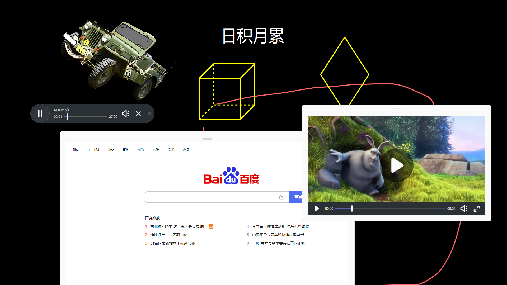

# ShowBoard
基于 Qt Graphics 的白板框架



## 特性：
- 各种白板资源，展示控件的管理，可无限扩展更多类型
- 内置资源的复制，删除，置顶等
- 内置处理控件的平移、缩放、旋转
- 支持多页面管理，页面也可以有子页面
- 更多特性请参考文档

# 快速尝试
通过 Conan 包管理器依赖
+ JFrog 源：conan remote add accumulating https://accumulating.jfrog.io/artifactory/api/conan/default-conan
+ 依赖配置：[requires] ShowBoard/develop@cmguo/test
+ 仅在 Qt 5.15.0 VS2019 上构建
+ 注意：需要部署各种扩展组件，才能够打开各种资源

# 方案说明
+ [用 Qt 实现电子白板](https://blog.csdn.net/luansxx/article/details/120645847)

## 基本用法：
```cpp
WhiteCanvasWidget widget(&mainWidget);
widget.resize(100, 100);
widget.canvas()->addResource("1.png") // 需要集成白板多媒体组件
```

## 扩展组件：
白板框架不包含具体组件；你可以自己实现，或者集成下列基础组件：
- 多媒体组件 ([MultiMedia](https://github.com/cmguo/MultiMedia))
- 几何图形组件 ([Geometry](https://github.com/cmguo/Geometry))
- 教学工具 ([TeachingTools](https://github.com/cmguo/TeachingTools))
